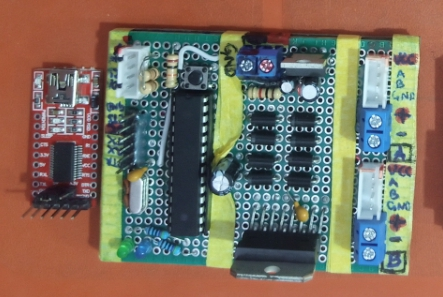

# Samuko Motor Controller (`smc`) Project
The parent repo of the Samuko Motor Controller (**smc**) Project.
 
 
One of the problems faced by students, learners, researchers, hobbyists, and even some startups in Mobile Robotics is `precise velocity control of DC Motors`. 
 
Traditionally, DC motors are controlled using PWM signals via an H-Bridge driver module which does not provide good velocity control of the connected motor(s) with feedback.
 
This generally makes it hard to design a good and precise `motor velocity controller` for the interfaced motor, not to mention implementing good motion planning algorithms on the mobile robot. 
 
Because of this, most mobile robotics projects revolves around (or are usually limited to) Telemetry operation, obstacle avoidance, line following, Opencv lane tracking/following (sometimes with AI), and so on or such that does not require any advanced motion planning and navigation algorithms like SLAM and so on.
 
 
The AIM of this project is to design and make available a motor driver system `(i.e a physical motor driver module, software and libraries)` that uses the PID control algorithm to help setup `precise velocity control for geared dc motors that uses quadrature encoders` and provide means for easy integration into any desired mobile robotics project.

>The motor driver system will allow the user to:
> - easily connect/interface any geared dc motor with a quadrature encoder to it.
> - easily setup the motor encoder and configure a velocity PID control for the connected/interfaced motor.
> - contol the motor directly with angular velocity commands (not PWM).
> - get the motor’s actual angular position and angular velocity as feedback.
> - easily integrate it into your microcontroller-based (Arduino) project.
> - easily integrate it into your microcomputer-based (Raspberry Pi, etc.) project.
> - easily integrate it into your ROS2-based project in wheeled mobile robotics.

> NOTE: `It can also be used in other projects that requires precise motor velocity control`

 
The `smc` project consist of the following sub-parts:

- `smc_l298n_pid_driver module`: It has a controller that handles the PID control. here's the link to the repo of the control driver code -> [smc_l298n_pid_driver_code](https://github.com/samuko-things-company/smc_l298n_pid_driver_code). The module provides a USB serial communication interface using the FTDI programmer to connect with a PC or micro-computer during Encoder and PID control parameter setup, microcomputer-based (Raspberry Pi, etc.) projects or ROS2-based projects. It also provides an I2C communication interface for microcontroller-based (Arduino) projects.

- `smc_app`: to help setup the Encoder and PID control parameters for the **geared DC motor with a quadrature encoder** connected to the **smc_l298n_pid_driver module**. Here's the lik to the repo -> [smc_app](https://github.com/samuko-things-company/smc_app)
- `smc_pyserial_lib`: library that helps communicate with the already setup motor control in you PC or microcomputer-based python projects. here's a link to the repo -> [smc_pyserial_lib](https://github.com/samuko-things-company/smc_pyserial_lib) 
- `smc_cppserial_lib`: library that helps communicate with the already setup motor control in you PC or microcomputer-based cpp projects. here's a link to the repo -> [smc_cppserial_lib](https://github.com/samuko-things-company/smc_cppserial_lib) 
- `smc_ros2_interface`: ros2 harware interface plugin package to help communicate with the already setup motor control in your ROS2-based mobile robotics project **(currently implemented in ROS2-humble LTS)**. here's a link to the repo -> [smc_ros2_interface](https://github.com/samuko-things-company/smc_ros2_interface) 
- `smc_i2c_lib`: arduino library that helps communicate with the already setup motor control via I2C in your arduino-based project (e.g Arduino nano, UNO, MEGA, ESP32, e.t.c). here's the link to the repo -> [smc_i2c_lib](https://github.com/samuko-things-company/smc_i2c_lib) 
 
 

.png)

## HOW TO USE THE `smc` IN YOUR PROJECT
- First of all get the `smc_l298n_pid_driver module` (it will come preloaded with the control code and also with an FTDI serial programmer for USB serial communication) then interface/connect your motor(s) with quadrature encoder to it and power it up.

- Download and install the `smc_app` on you PC (or clone the repo into your PC and run the application code). 

- Connect the `smc_l298n_pid_driver module` to your PC via the FTDI and start the `smc_app`. Setup your motor encoder and PID parameter.
  > **NOTE:** the parameter values you set are automatically saved to the microcontroller's memory (i.e it remembers the parameter values)

- After successfully setingup the PID controller, close the application, disconnect the driver module from the PC and hit the reset button on the `smc_l298n_pid_driver module`.

- connect it to your prefered project using any of the API library - `smc_pyserial_lib`, `smc_cppserial_lib`, `smc_ros2_interface`, or `smc_i2c_lib`.